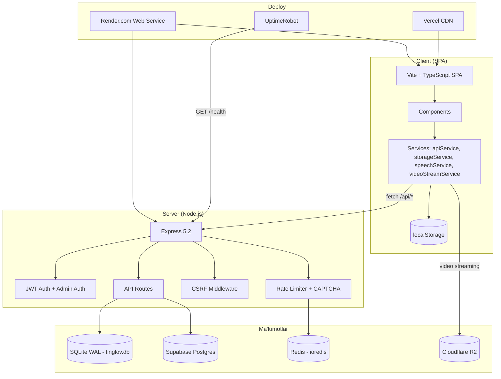
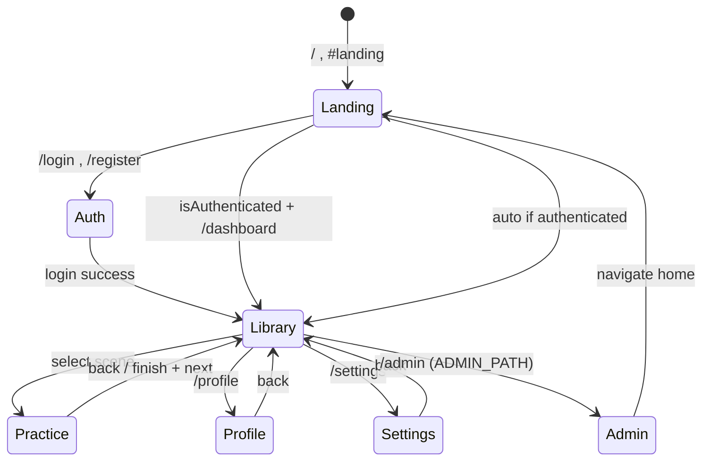
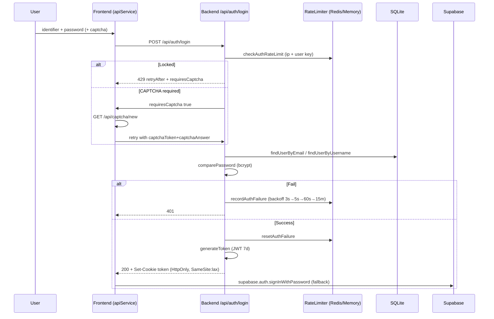
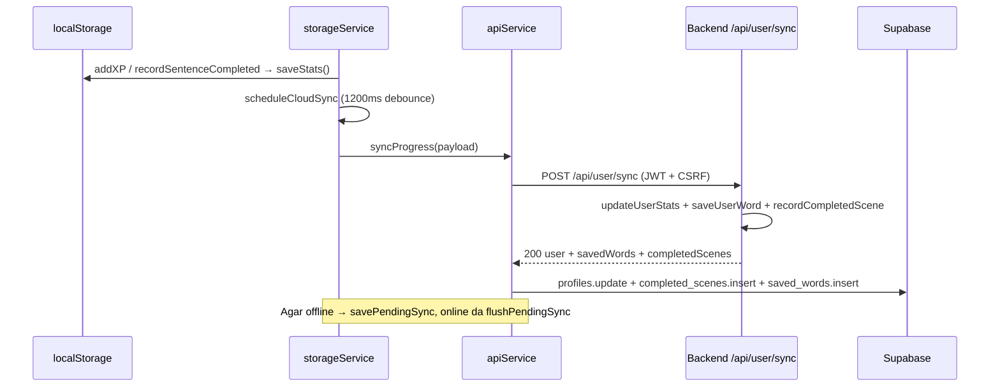
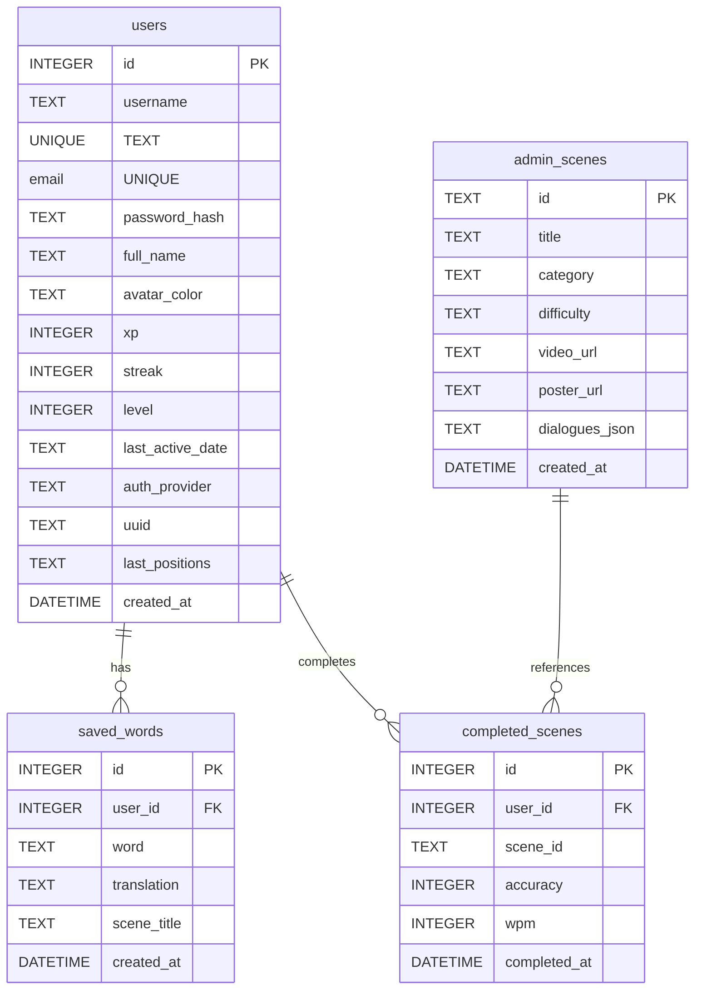
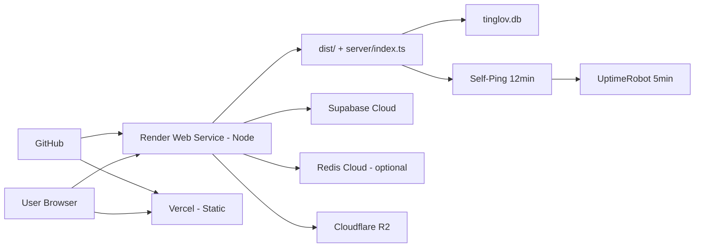

# Tinglov Arxitektura Hujjati

> Ushbu hujjat Tinglov platformasining yuqori darajadagi arxitekturasi, qatlamlari, oqimlari va qarorlarini tushuntiradi.

---

## 1. Umumiy Ko‘rinish



---

## 2. Frontend Arxitekturasi

### 2.1 Qatlamlar

```mermaid
flowchart LR
    subgraph Entry["Entry"]
        Main[src/main.ts - MovieListenApp]
    end
    subgraph Views["Views / Components"]
        Landing[LandingView]
        Library[LevelSelector]
        Practice[AnimatedStage + DictationInput]
        Profile[ProfileView/ProfileModal]
        Settings[SettingsView]
        Admin[AdminView]
        Modals[VocabularyModal, CompletionModal, ShadowingModal, ...]
    end
    subgraph Services2["Services"]
        Storage[storageService]
        API[apiService]
        Speech[speechService]
        Video[videoStreamService]
        I18n[i18nService]
    end
    subgraph Data2["Data"]
        Types[types/index.ts]
        Scenes[data/scenes.ts]
        Utils[utils/*]
    end
    Main --> Views
    Views --> Services2
    Services2 --> Data2
```



- **MovieListenApp** (`src/main.ts`, 1186 qator) — markaziy orkestrator: router, view switcher, klaviatura yorliqlari, Supabase `onAuthStateChange` listener.
- **Component modeli:** Har bir view klass sifatida (`StatsHeader`, `LevelSelector`, `AnimatedStage`, `DictationInput` va h.k.), `setCallbacks()` orqali event bog‘lanadi, `render()` DOM ni yangilaydi.
- **StorageService** (`storageService.ts`, 618 qator): `localStorage` da `UserStats`, `customScenes`, `highScores` saqlaydi, `syncWithServer()` da server bilan merge qiladi (XP max, scene union, word union), debounced `syncToCloud()` (1200ms), offline queue (`PENDING_SYNC_KEY`).
- **ApiService** (`apiService.ts`, 1283 qator): Token in-memory, session `localStorage` cache, CSRF headerlar, Supabase + backend parallel sync, admin metodlari.

### 2.2 Router



- `initRouter()` → `popstate` + `hashchange` listener, `routeInitialUrl()` da `waitForAuth()` bilan skeleton render.
- Dinamik admin yo‘li: `apiService.getAdminRoutePath()` → `window.__ADMIN_PATH__` yoki `VITE_ADMIN_PATH`.

### 2.3 Build

- `vite.config.ts`: `esbuild` drop `console/debugger` (prod), `manualChunks` (supabase, zod, dompurify), security headers (HSTS etc.), `sourcemap: false`.
- `tsconfig.json`: `ES2020`, `bundler` resolution, `strict: true`.

---

## 3. Backend Arxitekturasi

```mermaid
flowchart TB
    Req[HTTP Request] --> Trust[trust proxy 1]
    Trust --> CORS[cors + cookieParser + json]
    CORS --> SecHeaders[Security Headers: HSTS, CSP, X-Frame-Options, Permissions-Policy]
    SecHeaders --> CSRFcookie[CSRF Cookie Issue]
    SecHeaders --> Health{Path /health /ping ?}
    Health -->|yes| HealthHandler[healthCheckHandler - no rate limit]
    Health -->|no| APILimiter[apiLimiter 120/min]
    APILimiter --> CSRFtoken[GET /api/csrf-token /captcha/new]
    CSRFtoken --> RequireCSRF[requireCsrf middleware]
    RequireCSRF --> AuthRoutes[/api/auth/*]
    RequireCSRF --> UserRoutes[/api/user/* - requireAuth]
    RequireCSRF --> AdminRoutes[/api/admin/* - requireAdminAuth]
    RequireCSRF --> Public[GET /api/leaderboard /api/scenes]
    AuthRoutes --> DB[(SQLite + Supabase verify)]
    UserRoutes --> DB
    AdminRoutes --> DB
    DB --> Response[JSON Response]
    HealthHandler --> Response
```

- **Fayllar:**
  - `server/index.ts` (926 qator) — barcha route handlerlar, CSP, CSRF, keep-alive, SPA fallback.
  - `server/auth.ts` (150 qator) — `hashPassword`, `generateToken` (7d), `generateAdminToken` (24h), `requireAuth`, `requireAdminAuth`.
  - `server/db.ts` (377 qator) — `DatabaseSync` + WAL + 4 jadval + migratsiyalar + barcha CRUD.
  - `server/rateLimiter.ts` (531 qator) — Redis + memory fallback, CAPTCHA HMAC, `apiLimiter`, `registerLimiter`, `adminLoginLimiter`, `checkAuthRateLimit`.

### 3.1 Ma'lumotlar Oqimi — Auth



### 3.2 Sync Oqimi



---

## 4. Ma'lumotlar Modeli



- **Level formulasi:** `level = floor(sqrt(xp/25 + 0.25) - 0.5) + 1` → L2=50, L3=150, L4=300 XP. `getLevelProgress()` da ishlatiladi.
- **WAL mode:** `PRAGMA journal_mode = WAL` — o‘qish/yozish konkurensiyasi uchun.

---

## 5. Xavfsizlik Qatlamlari (Qisqa)

| Qatlam | Fayl | Mexanizm |
|--------|------|----------|
| CSP | `index.html` meta + `server/index.ts` header | `default-src 'self'`, `frame-ancestors 'none'`, `object-src 'none'` |
| CSRF | `server/index.ts` | `XSRF-TOKEN` (httpOnly:false) + `x-csrf-token` header verify, Bearer exempt |
| HSTS | `server/index.ts` + `vercel.json` | `max-age=31536000; includeSubDomains; preload` |
| JWT | `server/auth.ts` | `HS256`, `token` (7d, SameSite:lax), `admin_token` (24h, SameSite:strict) |
| CAPTCHA | `server/rateLimiter.ts` | HMAC-SHA256, 5min TTL, single-use, timingSafeEqual |
| Rate Limit | `server/rateLimiter.ts` | Redis `incr`+`pttl` yoki bounded memory (LRU 10k, 5min cleanup) |

Batafsil: [`SECURITY.md`](./SECURITY.md)

---

## 6. Deploy Arxitekturasi



- **Render:** `buildCommand: npm install && npm run build`, `startCommand: npm start`, env `generateValue` for secrets.
- **SPA Fallback:** `express.static(dist)` + `index.html` injection `window.__ADMIN_PATH__` va `window.__CLOUDFLARE_R2_URL__`.
- **Keep-Alive:** `setInterval 12min → /health`, UptimeRobot ham `/health` ga ping.

---

## 7. Muhim Qarorlar (ADR qisqa)

| Qaror | Sabab | Muqobil |
|-------|-------|---------|
| SQLite `DatabaseSync` (WAL) | Render free tier da Postgres yo‘q, fayl DB yetarli, WAL bilan konkurensiya yaxshi | Postgres / Supabase only |
| Redis ixtiyoriy + memory fallback | Free tier da Redis bo‘lmasligi mumkin, lekin prod da distributed limit kerak | Faqat memory (scale bo‘lmaydi) |
| Zod validatsiya har ikki tomonda | Frontendda tez feedback, backendda ishonchli himoya | Faqat frontend |
| HttpOnly cookie + Bearer fallback | XSS ga chidamli cookie, mobil/API uchun Bearer | Faqat cookie yoki faqat Bearer |
| Supabase Auth + lokal JWT parallel | Google OAuth oson, lokal JWT esa offline/tez | Faqat bittasi |
| `ADMIN_PATH` dinamik | Security through obscurity + brute-force qiyinlashadi | Hardcoded `/admin` |

---

## 8. Kengayish Rejasi

- **Shadowing AI:** Web Speech API → server-side Whisper baholash.
- **PWA:** Service Worker + offline dictation.
- **WebSocket:** Real-time multiplayer challenge.
- **Postgres migratsiyasi:** `DATABASE_URL` bo‘lsa SQLite o‘rniga `pg` driver.

---

*Qo‘shimcha:* [API](./API.md) · [Setup](./SETUP.md) · [Security](./SECURITY.md)
