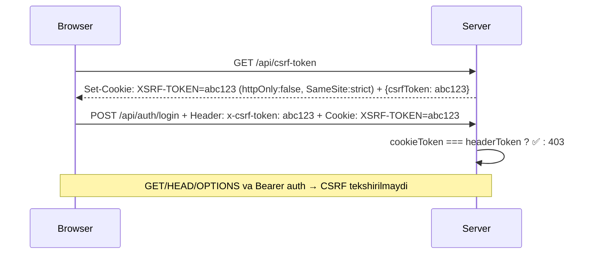

# Tinglov — Xavfsizlik Hujjati (SECURITY)

> Tinglov xavfsizlikni **birinchi o‘rinda** tutadi. Ushbu hujjat barcha himoya qatlamlarini, ularning qanday ishlashini va hisobot berish yo‘llarini tushuntiradi.

---

## 1. Xavfsizlik Qatlamlari Jadvali

| # | Himoya | Maqsad | Qayerda amalga oshirilgan | Kalit parametrlar |
|---|--------|--------|---------------------------|-------------------|
| 1 | **Content-Security-Policy (CSP)** | XSS, injection, clickjacking, data exfiltration ni bloklash | `shared/securityHeaders.ts` kanonik manbadan 3 nusxa (byte-identical): `index.html` `<meta http-equiv="Content-Security-Policy">` + `vite.config.ts` + `server/index.ts` middleware | `default-src 'self'`; `script-src 'self' https://unpkg.com https://cdn.jsdelivr.net` (`'unsafe-inline'` yo‘q — inline scriptlar `public/js/boot.js` da); `object-src 'none'`; `base-uri 'self'`; `frame-ancestors 'none'` |
| 2 | **CSRF (Cross-Site Request Forgery)** | Begona saytdan POST/DELETE ni bloklash | `server/index.ts` — `XSRF-TOKEN` cookie + `x-csrf-token` / `x-xsrf-token` header | `httpOnly:false` (JS o‘qiydi), `SameSite:strict`, 24 soat TTL; Bearer token bo‘lsa CSRF tekshirilmaydi (browser CSRF ga immunitet) |
| 3 | **JWT Autentifikatsiya** | Foydalanuvchi/admin sessiyasi | `server/auth.ts` — `jsonwebtoken` HS256 | `JWT_SECRET` ≥32 belgi (prod da majburiy), `token` cookie `httpOnly:true, SameSite:lax, Secure:prod, 30d`, user JWT `7d`, admin JWT `24h` |
| 4 | **CAPTCHA (HMAC)** | Brute-force ni sekinlashtirish | `server/rateLimiter.ts` — `crypto.createHmac('sha256', CAPTCHA_SECRET)` | Savol `3-14 ± 1-10`, token `base64url(payload).signature`, 5 daq TTL, **single-use** (replay blok), `timingSafeEqual` |
| 5 | **Rate Limiting** | DDoS / credential stuffing / spam | `server/rateLimiter.ts` — Redis (`ioredis`) + bounded memory fallback (10k, LRU/FIFO, 5min cleanup) | `apiLimiter` 120/min/IP, `registerLimiter` 5/soat/IP, `adminLoginLimiter` 20/15min/IP, auth backoff (3s→5s→60s→15m) |
| 6 | **HSTS + Security Headers** | MITM, MIME sniffing, clickjacking, referrer leak | `server/index.ts` middleware + `vercel.json` + `vite.config.ts` | `Strict-Transport-Security: max-age=31536000; includeSubDomains; preload`, `X-Content-Type-Options: nosniff`, `X-Frame-Options: DENY`, `X-XSS-Protection: 1; mode=block`, `Referrer-Policy: strict-origin-when-cross-origin`, `Permissions-Policy: camera=(), microphone=(self), ...` |
| 7 | **Bcrypt Parol Xeshlash** | Parol o‘g‘irlanishida himoya | `server/auth.ts` — `bcryptjs` 10 rounds | Hech qachon plain saqlanmaydi, `password_hash` maydoni `sanitizeUser` da filtrlanadi |
| 8 | **Validatsiya & Sanitizatsiya** | Injection, XSS, noto‘g‘ri ma’lumot | `src/utils/validation.ts` (Zod), `src/utils/sanitize.ts` (DOMPurify) | `registerSchema`/`loginSchema` strict, `escapeHtml` render da, `sanitizeLastPositions` (200 key limit, 120 char key) |
| 9 | **CORS & Trust Proxy** | Noto‘g‘ri origin / IP spoofing | `server/index.ts` — `app.set('trust proxy', 1)`, CORS `ALLOWED_ORIGINS` env allowlist funksiyasi (`ALLOWED_ORIGINS.includes(origin)`) + `credentials:true` | `req.ip` — eng o‘ng ishonchli hop, `X-Forwarded-For` chap qismi spoof qilinmaydi |
| 10 | **Anti-Clickjacking** | Iframe ichida o‘g‘irlash | `index.html` pre-paint `<style>` `body{display:none}` + `public/js/boot.js` (sinxron head script) `if(self===top)` framebuster | `X-Frame-Options: DENY` + `frame-ancestors 'none'` bilan defense-in-depth |

---

## 2. Batafsil Tushuntirish

### 2.1 CSP (Content Security Policy)

**Header (server)** — kanonik manba: `shared/securityHeaders.ts`; `index.html` `<meta>`, `vite.config.ts` va server middleware shu fayldan byte-identical 3 nusxa oladi:
```
default-src 'self';
script-src 'self' https://unpkg.com https://cdn.jsdelivr.net;
style-src 'self' 'unsafe-inline' https://fonts.googleapis.com https://unpkg.com;
font-src 'self' data: https://fonts.gstatic.com https://unpkg.com;
img-src 'self' data: https: blob: https://*.r2.dev https://*.r2.cloudflarestorage.com;
media-src 'self' blob: data: https://cdn.jsdelivr.net https://storage.googleapis.com https://*.r2.dev https://*.r2.cloudflarestorage.com https:;
connect-src 'self' https://*.supabase.co wss://*.supabase.co https://cdn.jsdelivr.net https://storage.googleapis.com https://*.r2.dev https://*.r2.cloudflarestorage.com https://unpkg.com https://fonts.googleapis.com https:;
frame-src 'self' https://www.youtube-nocookie.com https://www.youtube.com;
frame-ancestors 'none';
object-src 'none';
base-uri 'self';
```

- `script-src`da `unsafe-inline` YO‘Q — inline scriptlar `public/js/boot.js` ga ko‘chirilgan (sinxron head script), tashqi scriptlar faqat `unpkg.com` / `cdn.jsdelivr.net` allowlistidan.
- `style-src`da `unsafe-inline` hujjatlashtirilgan sabab bilan QOLGAN: pre-paint anti-clickjack `<style>` + `innerHTML` style attributelari + Vite dev CSS inject; `default-src 'self'` bilan cheklangan.
- `object-src 'none'` — Flash/Java applet blok.
- `base-uri 'self'` — `<base>` injection blok.

### 2.2 CSRF



- Cookie `httpOnly: false` — JS `document.cookie` orqali o‘qib headerga qo‘yadi (`src/utils/csrf.ts` → `getCsrfHeaders()`).
- `validateCsrfToken()` clientda ham tekshiradi (uzunlik, hex).

### 2.3 JWT

- **Imzo:** `HS256` + `JWT_SECRET` (env, prod da ≥32 belgi majburiy, bo‘lmasa `FATAL`).
- **Saqlash:**
  - `token` — `httpOnly:true, Secure:prod||RENDER, SameSite:lax, maxAge:30d` — asosiy user sessiyasi.
  - `admin_token` — `httpOnly:true, Secure:prod, SameSite:strict, maxAge:24h` — admin sessiyasi.
- **Tekshirish:** `requireAuth` → `extractToken()` (cookie → header cookie parse → Bearer) → `jwt.verify()` → `findUserById()` → `req.user`.
- **Admin:** `requireAdminAuth` → `role !== 'admin'` → `403`.

### 2.4 CAPTCHA

- **Generatsiya (`GET /api/captcha/new`):**
  ```
  question = "7 + 5 = ?" yoki "12 - 4 = ?"
  payload  = "id:answer:expiresAt"  (expiresAt = now + 5min)
  signature = HMAC-SHA256(CAPTCHA_SECRET, payload)  (hex)
  token = base64url(payload) + "." + signature
  ```
- **Verifikatsiya (`verifyCaptchaSolution`):**
  1. `isCaptchaTokenUsed()` → replay blok
  2. `base64url` decode → `timingSafeEqual(signature, expectedSig)`
  3. `Date.now() > expiresAt` → expired
  4. `String(answer) === String(userAnswer)` → `markCaptchaTokenUsed(token)` + `true`

### 2.5 Rate Limiting

| Limiter | Window | Max | Key | Xabar |
|---------|--------|-----|-----|-------|
| `apiLimiter` | 1 min | 120 | `api:<ip>` | `API so‘rovlar soni me‘yordan oshdi` |
| `registerLimiter` | 1 soat | 5 | `reg:<ip>` | `Juda ko‘p ro‘yxatdan o‘tish` |
| `adminLoginLimiter` | 15 min | 20 | `admin-login:<ip>` | `Admin kirish urinishlari me‘yordan oshdi` |

**Auth backoff (`recordAuthFailure`):**
- 3 fail → `delayMs: 3000`, `requiresCaptcha: true`
- 4–14 fail → `delayMs: 5000`
- 15–19 fail → `delayMs: 60000`, `lockedUntil = now+60s`
- 20+ fail → `delayMs: 15min`, `lockedUntil = now+15min`
- 30 min inaktivlikdan keyin `failures` reset.

**Redis vs Memory:**
- Redis bo‘lsa — `multi().incr().pttl().exec()` atomik, `pexpire`.
- Bo‘lmasa — `Map` 10k limit, `cleanMemoryStore` 5 min interval, 20% oldest eviction.

**Headerlar (har javobda):**
```
RateLimit-Limit: 120
RateLimit-Remaining: 87
RateLimit-Reset: 42
Retry-After: 60  (faqat 429 da)
```

### 2.6 HSTS & Boshqa Headerlar

| Header | Qiymat | Maqsad |
|--------|--------|--------|
| `Strict-Transport-Security` | `max-age=31536000; includeSubDomains; preload` | Faqat HTTPS (1 yil) |
| `X-Content-Type-Options` | `nosniff` | MIME sniffing blok |
| `X-Frame-Options` | `DENY` | Iframe blok |
| `X-XSS-Protection` | `1; mode=block` | Eski brauzer XSS filtri |
| `Referrer-Policy` | `strict-origin-when-cross-origin` | Referrer leak kamaytirish |
| `Permissions-Policy` | `camera=(), microphone=(self), geolocation=(), payment=()` | Keraksiz API blok |

### 2.7 Validatsiya

```ts
// src/utils/validation.ts (Zod)
registerSchema = z.object({
  username: z.string().min(3).max(20).regex(/^[a-zA-Z][a-zA-Z0-9_]*$/),
  email: z.string().email(),
  password: z.string().min(8).regex(/^(?=.*[A-Z])(?=.*\d)/),
  fullName: z.string().min(2).max(50)
})
```

- Barcha kirishlar `safeValidate()` orqali, xato matni foydalanuvchiga qaytariladi.
- `sanitizeLastPositions()` — JSON parse, max 200 key, har key 120 char truncate.

---

## 3. Hisobot Berish

Xavfsizlik zaifligi topsangiz:

1. **Ommaviy issue ochmang** — avval maxfiy xabar bering.
2. Email: `security@tinglov.uz` (yoki GitHub Security Advisories)
3. Kutilgan javob vaqti: **48 soat** ichida tasdiq, **7 kun** ichida tuzatish reja.

**Hisobotda bo‘lishi kerak:**
- Tavsif, qadamlar (PoC), ta’sir darajasi, taklif.

---

## 4. Tavsiyalar (Deployment)

- `JWT_SECRET` va `CAPTCHA_SECRET` ni har muhitda alohida, kuchli (`openssl rand -hex 32`) generatsiya qiling.
- `ADMIN_PATH` ni default `/admin` dan maxfiy yo‘lga o‘zgartiring (masalan `/maxfiy-panel-77`).
- `ADMIN_PASSWORD` ni kuchli va muntazam yangilang.
- Redis ni prod da yoqing (Upstash free yetarli).
- Supabase RLS ni o‘chirmang — har doim `auth.uid() = user_id` siyosati bo‘lsin.
- `vercel.json` va `server/index.ts` dagi HSTS ni `preload` bilan qoldiring.

---

*Oxirgi yangilanish: 2026-09-10 · Tinglov Security Team*
